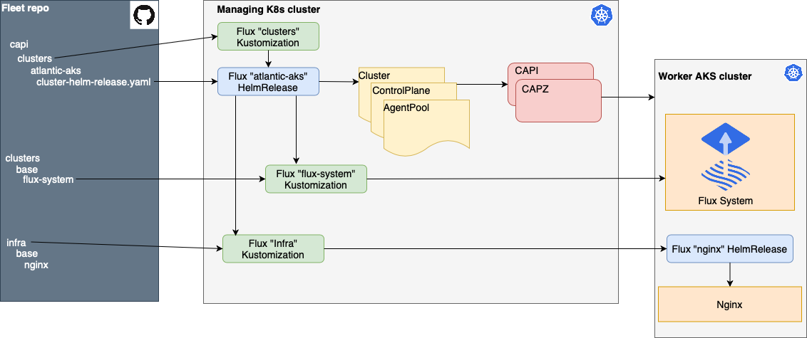

# Provision AKS clusters with Flux and CAPI

CAPI is an implementation of “K8s operator” pattern (resource + controller) to provision and manage k8s clusters. So we can define a “worker” cluster as a CRD resource and there is a controller running on “managing” cluster which brings the resource to the desired state by actually provisioning/altering the “worker” k8s cluster. That said, it opens a wide door for GitOps when the resource definitions (“worker” cluster descriptors) are delivered to the “managing” K8s cluster from a Git repository by a GitOps operator, e.g. Flux.

There are a number of various CAPI providers to provision clusters on different clouds (e.g. Azure, AWS, GCP, VMWare, etc.). In this example  [Cluster API Provider Azure (CAPZ)](https://capz.sigs.k8s.io/) provisions k8s clusters on Azure.

The diagram below demonstrates how it actually works:


Managing cluster can be any K8s cluster (AKS, Kind, k3s, etc.). It’s not supposed to run any workloads. Its purpose is to observe the Fleet repo and provision or update “worker” clusters that run the workloads. Therefore the managing cluster should have a GitOps operator (e.g. Flux) and CAPI/CAPZ installed.
Flux can be installed with the [Flux bootstrap command](https://toolkit.fluxcd.io/guides/installation/). Having done that, we should define a [Flux “clusters” Kustomization](https://github.com/kaizentm/multicluster-gitops/blob/main/capi/mngmt/clusters-sync.yaml) to observe capi/clusters folder in the Fleet repo:
```
apiVersion: kustomize.toolkit.fluxcd.io/v1beta1
kind: Kustomization
metadata:
  namespace: capi-worker-clusters
  name: worker-clusters
spec:
  interval: 10m0s
  sourceRef:
    kind: GitRepository
    name: flux-system
    namespace: flux-system
  path: ./capi/clusters
  prune: true
```
CAPI with the Azure provider implementation (CAPZ) can be installed on the managing cluster with the [following script](https://github.com/kaizentm/multicluster-gitops/blob/main/capi/mngmt/capi_setup.sh):
```
# Install cluster ctl https://cluster-api.sigs.k8s.io/user/quick-start.html#install-clusterctl
export AZURE_SUBSCRIPTION_ID=
export AZURE_TENANT_ID=
export AZURE_CLIENT_ID=
export AZURE_CLIENT_SECRET=

export AZURE_ENVIRONMENT="AzurePublicCloud"

export AZURE_SUBSCRIPTION_ID_B64="$(echo -n "$AZURE_SUBSCRIPTION_ID" | base64 | tr -d '\n')"
export AZURE_TENANT_ID_B64="$(echo -n "$AZURE_TENANT_ID" | base64 | tr -d '\n')"
export AZURE_CLIENT_ID_B64="$(echo -n "$AZURE_CLIENT_ID" | base64 | tr -d '\n')"
export AZURE_CLIENT_SECRET_B64="$(echo -n "$AZURE_CLIENT_SECRET" | base64 | tr -d '\n')"

export EXP_MACHINE_POOL=true
export EXP_AKS=true

clusterctl init --infrastructure azure
```

In order to add a cluster to the fleet we need to create a corresponding subfolder (e.g. atlantic-aks) in capi/clusters folder in the Fleet repo. The atlantic-aks subfolder contains a [Flux HelmRelease definition](https://github.com/kaizentm/multicluster-gitops/blob/main/capi/clusters/atlantic-aks/cluster-helm-release.yaml) pointing to a [Hem chart with all necessary CRDs](https://github.com/kaizentm/multicluster-gitops/tree/main/capi/mngmt/aks-cluster-chart) (e.g. Cluster, Control Plane, Agent Pool, etc.) that CAPI/CAPZ will use to provision a cluster in Azure. The HelmRelease also specifies values for the Helm chart such as cluster name, resource group name, agent pools names:

```
apiVersion: helm.toolkit.fluxcd.io/v2beta1
kind: HelmRelease
metadata:
  name: atlantic-aks-helm-release
  namespace: capi-worker-clusters
spec:
  chart:
    spec:
      chart: ./capi/mngmt/aks-cluster-chart
      sourceRef:
        kind: GitRepository
        name: flux-system
        namespace: flux-system
  interval: 10m
  values:
    name: atlantic-aks
    clusterResourceGroup: atlantic-aks-rg
    controlAgentPoolName: clatlpool
    workerAgentPoolName: wratlpool
```

Once a new cluster is defined in the Fleet repo, Flux “clusters” Kustomization reconciles the atlantic-aks HelmRelease and creates the CAPI resources in the cluster. CAPI/CAPZ sees the new resources and brings them to the desired state by provisioning the resources (AKS, node pool, subnet, etc.) in Azure.

Cluster Helm chart also defines “flux-system” and “infra” Flux Kustomizations. The first one remotely installs Flux on the new provisioned cluster so it can manage its workloads independently. The “infa” Kustomization is responsible for installing all required infrastructure configurations on the new cluster. In this example there is Nginx ingress controller to be set up on all clusters in the fleet. The “infa” Kustomization remotely creates a Flux “nginx” HelmRelease on the new cluster which in its turn will fetch the “nginx” Helm Chart from internet and install it on the cluster.

To delete or update a cluster, for example to add a new node pool or increase the number of nodes, we just need to make the changes in the Fleet repo. All configurations will be replicated automatically to Azure.
