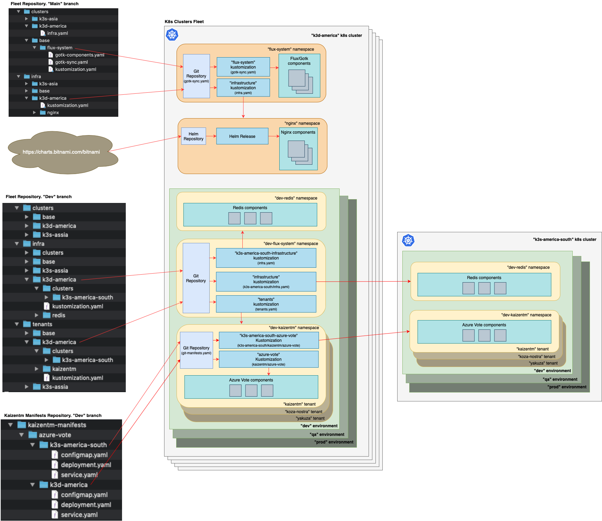

# Multi-cluster and multi-tenant environment with Flux v2

This repository contains a sample of GitOps setup that supports multi-cluster and multi-tenant environments with Flux v2. It used [Flux V2 Multi-Tenancy](https://github.com/fluxcd/flux2-multi-tenancy) repository as a starting point for considerations.

The repository targets to cover the following use-cases:

**Use-cases**:

1. *An organization has a few K8s clusters across the globe. Let's say a cluster per region (EMEA, Asia, America). There are also a few environments (Dev, Qa, Prod) distributed across these clusters. So each environment is represented on all clusters. There are also 100 teams working on these environments. When a team's application is being deployed to a Dev environment, for example, it's being deployed to all three clusters (in Dev environment). However, on each cluster the application behaves slightly differently (e.g. it communicates to external services hosted in that region). The desire is to have a single GitOps setup of the application, declaring that it should be deployed across all available clusters in the environment with a specific configuration for each cluster (e.g. different DB connection strings in different clusters, different load balancing settings, even different image tags).*

2. *There is a fleet of K8s clusters (e.g. 'edge' clusters at each POS location). There is a single GitOps setup of the application declaring that it should be deployed across all clusters defined in the fleet. The desire is to be able to easily add/remove a cluster to the whole setup.*

To better understand the solution provided in this repository, it would be helpful to follow the whole reconciliation process of a dev environment happening on one of the clusters in a fleet. This process is represented on the following diagram:

<!--  -->


The [fleet repository](https://github.com/kaizentm/multicluster-gitops) (this one) represents environments with branches. For example, [Dev branch](https://github.com/kaizentm/multicluster-gitops/tree/dev) describes clusters, infrastructure resources, tenants with their applications, everything that Dev environment consists of. QA branch describes resources for the QA environment and so on. In order to make changes in an environment configurations one needs to create a PR to the corresponding branch. Different branches/environments normally have different reviewing/approving policies.

The [Main branch](https://github.com/kaizentm/multicluster-gitops) contains resources outside of environments, things that are common and shared by all environments. It might be Flux binary components running in flux-system namespace, any common infrastructure microservices such as Nginx, for example. 

When a new cluster is added to the setup it should be bootstrapped with Flux. The [flux bootstrap](https://toolkit.fluxcd.io/cmd/flux_bootstrap/) command points to [cluster/base/flux-system](cluster/base/flux-system) folder in the Main branch and creates in the new cluster flux-system namespace, GitRepository source, Flux Kustomization, CRDs and all necessary Flux binary components. 

In addition to that [Flux Kustomization "infrastructure"](clusters/k3d-america/infra.yaml) is created to reconcile all common infra resources that should be installed on the cluster. In this case this reconciliation creates Nginx namespace, HelmRepository source and HelmRelease that will fetch Nginx helm chart from Bitnami Helm repository and install it on the cluster. Although Nginx is a common resource, which is supposed to be installed on every cluster, each cluster may have some specific configurations. Here we override ingress service port number in [infra/k3d-america/nginx/release.yaml](infra/k3d-america/nginx/release.yaml). Pay attention, that "cluster" here may represent not a single physical cluster but a group of clusters with the exact same configurations, for example a group of clusters in a region.  See [add a cluster](#add-a-cluster) procedure for the details.

When the new new cluster is added to an environment (e.g. dev), the dev-flux-system namespace, GitRepository source, Flux Kustomizations "infrastructure" and "tenants" are created. See [add a cluster to an environment](#add-a-cluster-to-an-environment) procedure for the details.

Flux Kustomizations "infrastructure" in the dev-flux-system namespace reconciles all infra resources that are specific for this environment. In this case dev-redis namespace with a corresponding deployment is created. We override specific for the k3d-america cluster deployment parameters in [infra/k3d-america/redis/redis.yaml](https://github.com/kaizentm/multicluster-gitops/blob/dev/infra/k3d-america/redis/redis.yaml). 

Flux Kustomizations "tenants" refers to a list of tenants sharing the Dev environment on this cluster. It creates a namespace for each tenant which is considered as a sandbox for this tenant in this environment on this cluster. Within the namespace it creates GitRepository source pointing to Dev branch of tenant's manifests repository that contains applications manifests to be deployed to the dev environment. Each tenant has a number of applications. For each of them a Flux Kustomization is created to reconcile the application resources. For example, Flux Kustomization "azure-vote" creates Azure Vote application components. Again, since the application on every cluster (even in the same environment) may be deployed with specific configurations, the Kustomization reads application manifests from k3d-america folder.

A cluster can be added to the fleet as a "remote" cluster. This means it doesn't have any Flux components installed and it's not connected to a Git repository. All deployments to a "remote" cluster are propagated by Flux working on a "management" cluster. For example "k3s-america-south" is a "remote" cluster managed by "k3d-america" "management" cluster. "k3d-america" cluster has Flux Kustomization "k3s-america-south-infrastructure" that replicates resources from infra/k3d-america/clusters/k3s-america-south folder to "k3s-america-south" cluster. In a similar way Flux Kustomization "k3s-america-south-azure-vote" in "dev-kaizentm" namespace replicates "azure-vote" application to 
"k3s-america-south" cluster. See [add a remote cluster to an environment](#add-a-remote-cluster-to-an-environment) procedure for adding a remote cluster to an environment.


### Add a cluster
To add a cluster to a fleet perform the following:
- Make sure kubectl context is configured to the new cluster
  ```
  kubectl config use-context YOUR_CONTEXT
  ```
- Add a cluster to the fleet
  ``` 
  export GITHUB_TOKEN=<your-token>
  export GITHUB_USER=<your-username>
  export GITHUB_REPO=<repository-name>

  ./utils/add-cluster.sh YOUR_CLUSTER_NAME
  ```
  This will create flux-system namespace in your cluster and create a few folders in the repo
  YOUR_CLUSTER_NAME may be a cluster group name, so every time we are adding a new cluster from the group we are specifying the same group name.
  
- Commit and push changes created by add-cluster.sh
- Check that new infra namespaces are created in the cluster, such as "nginx"
  ```
  kubectl get namespaces

  NAME              STATUS   AGE
  default           Active   28m
  kube-system       Active   28m
  kube-public       Active   28m
  kube-node-lease   Active   28m
  nginx             Active   7m48s
  flux-system       Active   24m
  ```    

### Add a cluster to an environment
To add a cluster to an environment (e.g Dev) switch to dev branch of this repo and perform the following:
- Execute the following command:
  ```
  ./utils/add-cluster-environment.sh YOUR_CLUSTER_NAME
  ```
  This will create YOUR_CLUSTER_NAME subfolders in "clusters","infra" and "tenants" folders. It will also create dev-flux-system namespace, "infrastructure" and "tenants" Flux Kustomizations in the cluster.  
- Commit and push changes created by add-cluster-environment.sh
- Check that new namespaces with environment specific infra (e.g. dev-redis) and tenants namespaces (e.g. dev-kaizentm) are created in the cluster
  ```
  kubectl get namespaces

  NAME              STATUS   AGE
  default           Active   3h5m
  kube-system       Active   3h5m
  kube-public       Active   3h5m
  kube-node-lease   Active   3h5m
  flux-system       Active   3h1m
  nginx             Active   164m
  dev-flux-system   Active   18m
  dev-kaizentm      Active   16m
  dev-redis         Active   16m
  ```

### Add a remote cluster to an environment
To add a remote cluster to an environment (e.g Dev) switch to dev branch of this repo and perform the following:
- Execute the following command:
  ```
  ./utils/add-remote-cluster-environment.sh MANAGED_CLUSTER_NAME REMOTE_CLUSTER_NAME KUBE_CONFIG_FILE
  ```
  for example 
  ```
  ./utils/add-remote-cluster-environment.sh k3d-america k3s-america-north ./k3s-america-north.conf
  ```
  where k3s-america-north.conf is a kubeconfig file to connect to k3s-america-north.
  This will create MANAGED_CLUSTER_NAME/REMOTE_CLUSTER_NAME subfolder in "clusters" folder and MANAGED_CLUSTER_NAME/clusters/REMOTE_CLUSTER_NAME subfolders in "infra" and "tenants" folders. 
- Commit and push changes created by add-remote-cluster-environment.sh
- Check on the "remote" cluster "k3s-america-north" that new namespaces with environment specific infra (e.g. dev-redis) and tenants namespaces (e.g. dev-kaizentm) are created in the cluster
  ```
  kubectl get namespaces

  NAME              STATUS   AGE
  default           Active   3h5m
  kube-system       Active   3h5m
  kube-public       Active   3h5m
  kube-node-lease   Active   3h5m
  dev-kaizentm      Active   16m
  dev-redis         Active   16m
  ```

### Remove a cluster from an environment
To remove a cluster from an environment (e.g Dev) switch to dev branch of this repo and perform the following:
- Execute the following command:
  ```
  ./utils/remove-cluster-from-environment.sh YOUR_CLUSTER_NAME
  ```
  This will delete YOUR_CLUSTER_NAME subfolders in "clusters","infra" and "tenants" folders. It will also delete dev-flux-system namespace, "infrastructure" and "tenants" Flux Kustomizations in the cluster.  
- Commit and push changes created by remove-cluster-from-environment.sh
- Check that environment specific namespaces are deleted
  ```
  kubectl get namespaces

  NAME              STATUS   AGE
  default           Active   3h5m
  kube-system       Active   3h5m
  kube-public       Active   3h5m
  kube-node-lease   Active   3h5m
  flux-system       Active   3h1m
  nginx             Active   164m
  ```

### Add a tenant
To add a tenant to an environment switch to the environment branch (e.g. dev) and perform the following:
- Execute the following command
  ```
  ./utils/add-tenant.sh TENANT_NAME REPO_URL REPO_BRANCH_NAME
  ```
  for example 
  ```
  ./utils/add-tenant.sh yakuza https://github.com/yakuza/gitops-manifests dev
  ```
  This will create corresponding subfolders for each cluster in "tenants" folder.
- Commit and push changes created by add-tenant.sh
- Check that tenant's namespace for this environment (e.g dev-yakuza) is available on the environment clusters
  ```
  kubectl get namespaces

  NAME              STATUS   AGE
  default           Active   3h5m
  kube-system       Active   3h5m
  kube-public       Active   3h5m
  kube-node-lease   Active   3h5m
  flux-system       Active   3h1m
  nginx             Active   164m
  dev-flux-system   Active   18m
  dev-kaizentm      Active   16m
  dev-redis         Active   16m
  dev-yakuza        Active   16m
  ```

### Add tenant'a application
To add tenant's application to an environment switch to the environment branch (e.g. dev) and perform the following:
- Execute the following command
  ```
  ./utils/add-app.sh TENANT_NAME APP_NAME
  ```
  This will create corresponding subfolders for each cluster in "tenants" folder.
- Commit and push changes created by add-tenant.sh
- Check that application components have been installed on the environment clusters


### Init an environment
To initialize a new environment create a new branch from an existing environment (e.g. dev)
for example
```
git checkout -b qa
```
and execute the following command:  
```
./utils/init-environment.sh qa
```
this will clean all clusters, infra and tenants subfolders and leave only initial files. 


### Resources
- [Multi-Tenancy Strategies](https://github.com/fluxcd/flux2/discussions/263)
- [Flux V2 Multi-Tenancy](https://github.com/fluxcd/flux2-multi-tenancy)
- [Flux v2 Kustomize-Helm example](https://github.com/fluxcd/flux2-kustomize-helm-example)
- [Multicluster environments discussion](https://github.com/fluxcd/flux2/discussions/766)
