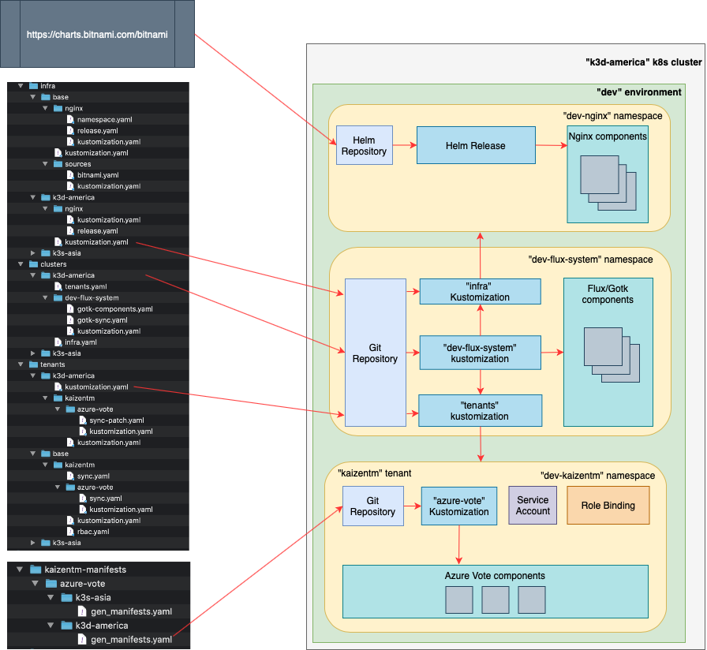

# Multi-cluster and multi-tenant environment with Flux v2

This repository contains a sample of GitOps setup that supports multi-cluster and multi-tenant environments with Flux v2. It used https://github.com/fluxcd/flux2-multi-tenancy repository as a starting point for considerations.

It targets to cover the following use-cases:

**Use-cases**:

1. *An organization has a few K8s clusters across the globe. Let's say a cluster per region (EMEA, Asia, America). There are also a few environments (Dev, Qa, Prod) distributed across these clusters. So each environment is represented on all clusters. There are also 100 teams working on these environments. When a team's application is being deployed to a Dev environment, for example, it's being deployed to all three clusters (in Dev environment). However, on each cluster the application behaves slightly differently (e.g. it communicates to external services hosted in that region). The desire is to have a single GitOps setup of the application, declaring that it should be deployed across all available clusters in the environment with a specific configuration for each cluster (e.g. different DB connection strings in different clusters, different load balancing settings, even different image tags).*

2. *There is a fleet of K8s clusters (e.g. 'edge' clusters at each POS location). There is a single GitOps setup of the application declaring that it should be deployed across all clusters defined in the fleet. The desire is to be able to easily provision, add/remove a cluster to the whole setup.*

To better understand the solution provided in this repository, it would be helpful to follow the whole reconciliation process of a dev environment happening on one of the clusters in a fleet. This process is represented on the following diagram:

The core controlling components live in the "dev-flux-system" namespaces. It is named "dev-..." because it's dev environment. This namespace has been created while boostrapping the cluster with ...   

